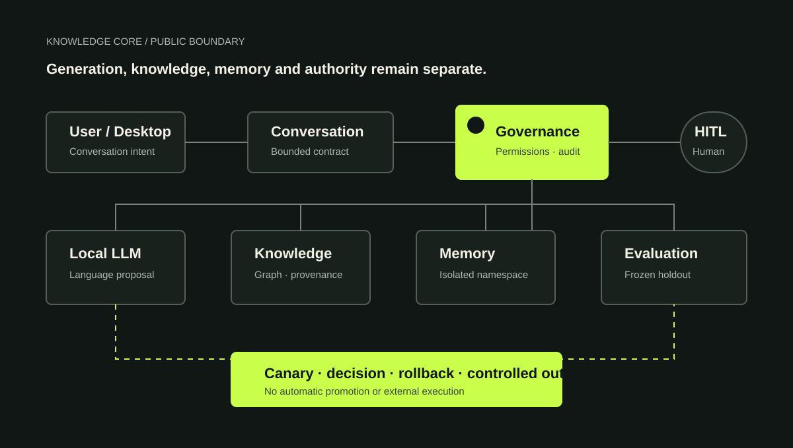

# Knowledge Core

> A governed, local-first GenAI engineering showcase.

Knowledge Core explores how to build a personal GenAI system without confusing language generation, knowledge, memory and authority. This public repository is a sanitized architectural showcase, not the private runtime.



Why I built it

I wanted to learn beyond a single chatbot demonstration:

- how to separate generated text from sourced knowledge;
- how to make provenance checks understandable;
- how to evaluate changes against a fixed set of cases;
- how to keep sensitive actions behind explicit human validation;
- how to make a configuration change reversible.

The project taught me that a convincing output is not enough. A useful GenAI system also needs observable boundaries, failure cases, and a clear answer to “who decides?”.

## What you can run here

Two deliberately small examples expose the reasoning without publishing the private application:

1. [`examples/provenance_gate.py`](examples/provenance_gate.py) accepts a claim only when its evidence is identified and reviewed.
2. [`examples/rollback_rehearsal.py`](examples/rollback_rehearsal.py) modifies a temporary configuration, restores it, and verifies the restoration byte for byte.

Run them and their tests with:

```bash
python examples/provenance_gate.py
python examples/rollback_rehearsal.py
python -m unittest discover -s tests -v
python scripts/validate_showcase.py
```

Both examples use only the Python standard library.

## What this repository demonstrates

- a provenance boundary that is short enough to inspect line by line;
- a reversible-update rehearsal with before/after hashes;
- automated tests for accepted and rejected paths;
- public documentation of architecture, evidence, limits, and repository boundaries.

## What it does not claim

- this is not a production platform;
- the published examples are not an independent benchmark;
- the private runtime is not reproducible from this repository alone;
- no unsupervised external action is demonstrated;
- project-size counts do not prove model quality or business impact.

## Repository map

```text
examples/                 Small runnable engineering examples
tests/                    Unit tests for the examples
docs/architecture.md      Conceptual workflow
docs/governance.md        Human validation and action boundaries
docs/evidence.md          Reproducible evidence and limitations
docs/roadmap.md           Plain-language next steps
docs/repository-boundary.md
scripts/validate_showcase.py
```

## Five-minute demo

1. Explain the problem: generated text must not be confused with reviewed knowledge.
2. Run the provenance example and show one accepted and one rejected claim.
3. Run the rollback rehearsal and compare its hashes.
4. Run the unit tests.
5. Explain what remains private, what remains unproven, and what you would test next.

## License

The public showcase is provided for portfolio review. Private Knowledge Core sources, data, and personal material are excluded.

## License

Copyright © 2026 Adrien Hummel. All rights reserved.
